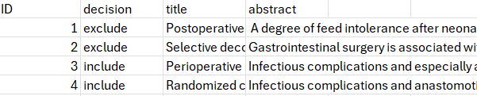

# Summary

The time-consuming task of title-abstract screening in the preparation of a systematic review can be partially automated through the use of machine learning models. These models are often trained on the
document-term matrix derived from the collection of titles and abstracts. In this paper, we present
the R package **MetaNLP**, which allows the transfer of a CSV file containing titles
and abstracts into a document-term matrix with just a few lines of code.
Furthermore, it provides a variety of functions to modify this matrix according to user
preferences and includes helpful summary and visualization features.

# Statement of need

In the process of conducting a systematic review, title and abstract (TIAB) screening is especially time-consuming, as it is standard practice for at least two human reviewers to independently assess all identified citations and determine whether each should be included or excluded from the subsequent full-text screening. However, this task involves plain text reading and could 
potentially be performed using natural language processing (NLP) and machine 
learning (ML) methods to tackle the problem of classifying the records in 
"include/exclude". A certain proportion of the citations to screen can be 
classified by humans and used as training data to train a ML model.
This ML model can then classify the remaining citations, either acting alone or
alongside a second human reviewer.

Besides pre-implemented, but non-flexible ML tools like Rayyan [@Rayyan] 
or fine-tuned large language models [@Dennstadt2024], there are approaches that take
the titles and abstracts of the publications, compute the 
document-term matrix and train ML models based on this matrix [@Lange2021; @Kebede2023; @Pilz2024].
This approach provides the user with the flexibility to exclude negligible
words and to train different ML algorithms, making it easier to apply the best
algorithm for the problem at hand.

The R-package **MetaNLP** supports programmers that aim to employ
this approach. It provides all necessary functionality to create and flexibly modify the document-term
matrix from a CSV file that contains titles and abstracts.
This allows the user to perform essential NLP tasks with minimal code and
quickly start the training of ML algorithms.


# Methodology

The titles and abstracts must be organized in a CSV file, with each row representing one citation. The CSV must have a column `ID` to clearly 
identify each citation, a column `title` containing the titles, and another column `abstract`. A decision column is only required when the CSV is used to train supervised ML algorithms.

**MetaNLP** then processes the CSV in several distinct steps: 
At first, the CSV file containing the titles and abstracts is read and scanned for 
missing values or empty strings. Words containing special characters or numbers are 
removed, upper case letters are set to lower case, and all unnecessary empty spaces are stripped.

In the second step, each word is lemmatized. Here, we make use of the package **textstem** [@textstem].

Following lemmatization, the words are subjected to stemming. The algorithm 
conducting the stemming is called Porter's stemming algorithm [@Porter1980],
implemented via the the R-package **SnowballC** [@SnowballC].

In the final step, the document-term matrix is created.
For each lemmatized and stemmed word, the number of appearances in the title
and abstract is determined, potentially weighted, and written into the matrix.

The whole processing pipeline described above makes use of the R-package **tm** [@tm].

Additionally, **MetaNLP** offers the function `select_features` 
to apply elastic net regularization within the data processing workflow. Here, the 
R-package **glmnet** [@glmnet1; @glmnet2] is applied.

# Usage

**MetaNLP** creates the document-term matrix from a CSV file containing all
the abstracts and the "include/exclude" decision. It should have the following form:



The creation of the document-term matrix is simple now.

```
library(MetaNLP)
dtm <- MetaNLP("data/example.csv", 
               bounds = c(2, Inf), 
               word_length = c(3, Inf),
               weighting = "frequency",
               language = "english")
```

The argument `bounds` specifies how often a word must occur to become part of 
the document-term matrix. The argument `word_length` determines the minimum and 
maximum number of characters a word should have. The argument `weighting` is used to 
specify the weighting function used for the creation of the document-term matrix. 
The argument `language` is used to adapt the lemmatization and stemming algorithms
with respect to the language of the titles and abstracts. 
The resulting object `dtm` has a slot `data_frame` which contains the desired document-term
matrix.

## Visualize `MetaNLP` objects

The function `summary` provides a comprehensive overview of the data, showing the most common words in total and stratified by "include" and "exclude". 

```
summary(dtm, n = 5, stop_words = TRUE)
```

As stop words may not provide any useful information, they can be excluded from
the summary by specifying `stop_words = FALSE`. 

One way to visualize a `MetaNLP` object is the `plot` function which creates a bar 
chart of the $n$ most common words. The `decision` argument defines whether to 
show the most frequent words from "include", "exclude"", or both (default: 'total')

```
plot(dtm, n = 10, decision = "total", stop_words = FALSE)
```

## Delete words

A typical step to reduce the number of columns is the deletion of stop words.

```
dtm_delete <- delete_stop_words(dtm)
```

In general, words can be easily removed by the method `delete_words`,
which takes a MetaNLP-object and a list of words as arguments.

```
dtm_delete <- delete_words(dtm_delete, c("aim", "administer"))
```

## Dimension reduction

In order to further reduce the dimensionality of the feature space, **MetaNLP** 
offers the method `select_features`.

```
dtm_1se <- select_features(dtm, alpha = 0.2, lambda = "1se", seed = 42)
```

The argument `alpha` denotes the elastic net mixing parameter and `lambda` is the 
parameter of the penalty. 
More detailed information is provided in the function's documentation.

## Test data

Assume a ML model has been trained on the document-term matrix and will now be used to classify additional citations. For this, 
the document-term matrix of the new (test) data must have exactly the same features as the matrix
of the training data. The function `read_test_data` takes a `MetaNLP` object and 
the path to the test data. It then assimilates its columns by removing columns 
which only appear in the test data and by adding columns as zero-columns which only exist in the 
document-term matrix used for training.
 
```
test_dtm <- read_test_data(dtm, "data/example_test.csv")
```

# References
